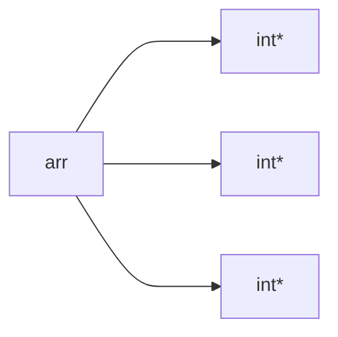
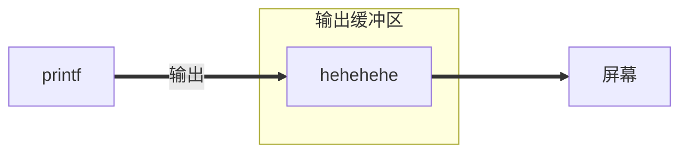

# c语言基础

C语言标准规定: `sizeof(long)>=sizeof(int)`

C语言语法规定,变量要定义在当前代码的最前面

```c
int num=20;//全局变量-定义在代码块({})之外的变量
int main()
{
    int num=10;//局部变量-定义在代码块({})内部
    printf("%d ",num);//名字相同 局部变量优先
    return 0;
}
```

**变量的作用域和生命周期**

作用域

>变量哪里可以用哪里就是它的作用域

局部变量的作用域是变量所的局部范围(在所定义的{}内)

全局变量的作用域是整个工程

```c
extern int g_val;//extern 声名外部符号的
```

生命周期

> 变量的生命周期是变量的创建到变量的销毁之间的一个时间段

局部变量的生命周期是:进入作用域生命周期开始,出作用域生命周期结束.

合局变量的生命周期是:整个程序的生命周期.

### 常量

* 字面常量

  ```c
  9;
  ```

* const 修饰的常变量

  ```c
  const int sum=1;
  ```

*  `#define` 定义的标识符常量

* 枚举常量

  ```c
  #include <stdio.h>
  enum Sex
  {
      MALE,//默认从0开始,也可以赋值
      FEMALE,
      SECRET
  };
  int main()
  {
      enum Sex s=MALE; 
      return 0;
  }
  ```

###**字符串**

字符串的结束标志是一个 `\0 `  的转义字符

> 转义符：转变原来的意思，转义符算一个字符
>
> ```c
> #include <stdio.h>
> int main()
> {
>     printf("c:\test\32\test.c");
>     printf("c:\\test\\32\\test.c");
>     return 0;
> }
> ```
>
> 转义符
>
> | 转义字符 | 释义                             |
> | -------- | -------------------------------- |
> | \a       | 警告字符，蜂鸣                   |
> | \\'      | 在单引号内部打印一个普通的单引号 |
> | \\"      | 在双引号内部打印一个普通的双引号 |
> | \ddd     | ddd表示1~3个八进制的数字，       |
> | \xdd     | dd表示2个十六进制数字，          |

###**操作符**

> 移(2进制)位操作符
>
> <<	左移
>
> \>> 	右移
>
> ```c
> int a=1;
> int b=a<<1//左移一位，补0
> ```
>
> 位(2进制)操作
>
> &	按位与
>
> |	按位或
>
> ^	按位异或
>
> ~~~c
> //&	按位与(并且)
> int a=3,b=5;
> int c=a&b;//两个同时为真才为真
> //| 按位或
> int a=3,b=5;
> int c=a|b;//一个为真都为真
> //^ 按位异或
> int a=3,b=5;
> int c=a|b;//相同为0，相异为1
> /*
> 011		011		011
> 101		101		101
> 001 	111		110
> */
> //~ 对一个数的二进制按位取反
> int a=0;
> int b=~a;
> ~~~
>
> 逻辑操作符
>
> &&	逻辑与
>
> ||	逻辑或
>
> ```c
> //&&	逻辑与
> if(1&&1)//两个为真都为真
> {
>     printf("为真");
> }
> if(1||0);//一个为真都为真
> {
>     printf("为真");
> }
> ```
>
> 条件操作符
>
> `exp1 ? exp2 : exp3`
>
> ```c
> int a=3,b=4;
> a>b ? a : b//如果表达式1为真,得表达式2. 则得表达式3
> ```
>
> 逗号表达式
>
> exp1,exp2,exp3,...expN
>
> 以最后一个数为准


###**原反补**

因为计算机中只有加法，所以发明补码，用来减法,存在计算机内存中的是这个数的补码. 正数的补码是它本身

`-1`的原反补(反码-1,补码+1)

> 10000000 00000000 00000000 00000001		**原码**
>
> 11111111 11111111 11111111 11111110		**反码**:符号位不变,取反
>
> 11111111 11111111 11111111 11111111		**补码**:反码+1

**`1-1 `**在计算机如何计算.(计算机没有减只有加法,这就用到了补码),**存在内存的是补码,所以用补码相加**

> 1写成二进制,因为正数的原反补相同
>
> 00000000 00000000 00000000 00000001
>
> 求出-2的补码
>
> 10000000 00000000 00000000 00000011		**原码**
>
> 11111111 11111111 11111111 11111100		**反码**
>
> 11111111 11111111 11111111 11111101		**补码**:反码+1
>
> _____
>
> **补码相加**
>
> 00000000 00000000 00000000 00000001	十进制:	1
>
> 11111111 11111111 11111111 11111101	十进制:	4,294,967,293
>
> 11111111 11111111 11111111 11111110	十进制:	4,294,967,294
>
> **求出原码**
>
> 因为符号位是 1 所以是负数 需要原反补
>
> 11111111 11111111 11111111 11111110	**补码**
>
> 11111111 11111111 11111111 11111100	**反码**:补码-1
>
> 10000000 00000000 00000000 00000011	**原码**

###**常见关键字**

**auto:**自动变量,局部变量也叫自动变量,因所有局部变量前面都有个`auto`, 所以省略掉了.**`auto int a=10;`**

**const:**修饰常变量

**extern:**引用外部符号

**typedef**:类型重命名

**register:**寄存器

>```c
>register int a=10;//把a定义成寄存器变量
>```

**volatile**

**static:**修饰局部变量,改变**生命周期**,让生命周期变长. 

修饰全局变量,改变了**做用域**,让静态的 全局变量只能在自己所在的源文件内部

使用,出了源文件就没法使用了

修饰函数**改变了函数的链接属性**(函数本身具有外部链接属性),

外部链接属性--->内部链接属性

#### 计算机存储数据

**硬盘\==> 内存\==>高速缓存==>寄存器**

**cpu**会先从**寄存器**去访问数据(**因为访问速度会更快**),如果没有依次访问

###\#define 定义常量和宏

**pragma once**:保证所在文件只会被包含一次，它是基于磁盘文件的，而#ifndef则是基于宏的

~~~c
//define 定义标识常量
#define MAX 1000
//define 定义宏
#define ADD(x,y) ((x)+(y))//只进行替换
~~~

### 指针

**一个地址是32/64根地址线所占内存就是4个字节**

##### 内存

**地址:**由32/64根地址线/数据线组成

每根线分别有**正电和负电**(1和0). 产生了 **2^32^** 的地址. 能 访问 **2^32^** 个内存块(每个内存块是字节)

也就是能操作 **2^32^** 个字节 换成十进制 4,294,967,296个字节

`4,294,967,296/1024=4,194,304`个 **kb**

`4,194,304/1024=4,096`个**mb**

`4,096/1024=4`个**GB**

### 结构体

```c
struct Book
{
    char name[50];
    int prince;
};//结构体类型 struct Book

int main()
{
	struct Book book={"如成为关景阳这样的大帅b",88888};
    struct Book* pbook=&book;
    printf("书名:%s\n价格:%d\n",book.name,book.prince);
	printf("\n书名:%s\n价格:%d\n",pbook->name,pbook->prince);
    return 0;
}
//. 结构体变量.成员
//-> 结构体指量->成员
```

 **`.`跟`->`区别**

**`pbook->name`** 与**` (*pbook).name`** 是等价的

其中`pbook`是地址 而book 是变量

### 语句

`else`对离它最近`if`进行匹配

```c
//switch 语句
switch(整型表达式)//必须是整型
{
    case 整型常量表达://
        break;
    default://其他
        break;
}
```

```c
//例题
int main()
{
    int n=1;
    int m=2;
	switch(n)
    {
        case 1: m++; //2+1
        case 2: n++; //1+1
        case 3: 
            switch (n)
            {
                case 1: n++;
                case 2: m++;n++;break; //3+1 2+1
            }
        case 4: m++; //4+1
            break;
        default:
            break;
    }
    printf("m=%d n=%d",m,n);//m=5 n=3
    return 0;
}

```

**break 和 continue**

>**break**
>
>跳出循环
>
>**continue**
>
>终止循环中的**本次**循环,后面的代码不到执行. 跳到循环的判断部分. for会跳到调整部分

**EOF**: `-1`文体结束标志 , 键盘上获取**EOF**按 **ctrl+z**==EOF

**for**:for的初始化,调整,判断都可以省略.for 的判断部分如果被省略,那判断条件就是:恒为真


### 输入函数

~~~c
#include <stdio.h>

int main()
{
    int ret=0;
    char password[20]={0};
    printf("请输入密码:>");//输入 1234656
    scanf("%s",password);
    printf("请确认Y/N:>");
    ret=getchar();
    if(ret=='Y')
    {
        printf("确认成功\n");
    }
    else
    {
         printf("放弃确认\n");
    }
    return 0;
}
//每个输入函数 都会从输入缓冲区读取数据.scanf 函数从输入缓冲区读取我们所输入的
//的数据. 但没有读取我们的回车--10,而getch 在从缓冲区获取 还有个 \n .
~~~

~~~c
#include <stdio.h>
int main()
{
	char ch[4] = { 0 };
	getchar();//输入abcd
	scanf("%s", ch);
	printf("%s",ch);
	return 0;
}
~~~

**scanf**:只会获取空格前面的东西

### 函数递归

**避头文件包含重复**

~~~c
#ifndef __ADD_H__ //定义 __ADD_H__
#define __ADD_H__
//函数的声明
#endfif
~~~

### **内存分为**

1. 栈区

   * 局部变量
   * 函数形参

2. 堆区

   ​	动态开辟的内存

   * malloc
   * calloc

3. 静态区

   * 全局变量
   * static修饰的变量

**递归的两个必要条件**

* 存在限制条件.当满足这个条件的时候,递归便不再继续
* 每次递归调用之后越来越接近这个条件

> 数组传参传的不是整个数 组而是首元素地埴

**递归在回调时不会在执行自己先前调用时执行的代码**

<**剑指offer**>

### 数组

数组是一组同类型元素的集合

> 使用二维数组时行和列不能同时省略
>
> 也不能省略列,可以省略行

~~~c
int main()
{
    int arr[]={1,2,3};//每个元素的类型为int类型
    int i=0;
    for(i=0;i<3;i++)
    {
        printf("%d ",arr[i]);//*(arr+0)
        printf("%d ",*(arr+i));//arr+0 等于首元素的地址 在解引用找到元素 1
    }
    
    return 0;
}
~~~

**二维数组存储的地址也是连续的**

#### 数组传参

数组传参不是数组本身,是首元素地址

**数组名有两个例外**

1. `sizfoe(arr)`:在sizfoe内部表示数组名
2. `&arr`:&数组名

> 只有这两个代表整个数组,除了这俩个所有的数组都表示首元素地址,
>
> 数组名+1跳整个数组,

**arr** 单独存在表示首元素地址

#### 一些按键的值

上下左右 **分别是**:72,80,75,77

esc:27

hljk:104,108,106,107

### c语言运算符详解

##### **移位操作符**（作用于整数）

​		**右移操作符有两种移法**

1. 算术右移
   * 右边丢弃,左边补原符号位

2. 逻辑右移
   * 右边丢弃,,左边补0

​		**左移操作符**

​	左边丢弃,右边补0

> 向左移动1位有乘2的效果

**例**:

~~~c
int a=16;
int b=a >> 2;
~~~

**注:**对于移位运算符,不要移动负数位,这个是标准未定义的

##### 位操作符（作用于整数）

​	**按位与 &**

> 两个数的`bit`都为真才为真

​	**按位或 |**

> 两个数的`bit`两个为假才为假

​	**按位异或 ^**

> 两个数的`bit`相异才为真,相同为假

**例**：

~~~c
int a=3,b=5;
int c=a&b;
~~~

**不创建临时变量（第个三变量），交换2个数的值**

~~~c
#include <stdio.h>

int main()
{
    int a=3,b=5;
    a=a^b;//获取一个密码，在进行异或能得到原来的数字
    b=a^b;
    a=a^b;
    return 0;
}
~~~

##### 单目操作符

**sizeof**

```c
int main()
{
    short s=0;
    int a=10
////不管什么类型只要结果存放在s,就跟据 s类型而定
    printf("%d",sizeof(s=a+5));//sizeof内部不参于运算的 
    printf("%d",s)
    return 0;
}
```

**~**  按位取反(二进制位)

> 二进制所有位取反 `~a`

关于 && 和 ||**练习**

**&&**

~~~c
int main()
{
    int i=0,a=0b=2,c=3,d=4;
    i=a++ && ++b && d++;
    
    printf("a=%d\n b=%d c=%d d=%d",a,b,c,d);
    //1,2,3,4
    a=1;//如果a变成1
    printf("a=%d\n b=%d c=%d d=%d",a,b,c,d);
    //2,3,3,5
    return 0;
}//&& 如果左值为假 右边不再计算
~~~

**||**

~~~c
int main()
{
    int i=0,a=0b=2,c=3,d=4;
    i=a++ && ++b && d++; 
    
    printf("a=%d\n b=%d c=%d d=%d",a,b,c,d);
    //1,2,3,4
    a=1;//如果a变成1
    printf("a=%d\n b=%d c=%d d=%d",a,b,c,d);
    //2,3,3,5
    return 0;
}//|| 如果左值为真 右边不再计算
~~~

**逗号表达式从左依次计算，取最后的值**

##### 下标引用操作符

操作数：一个数组名+一个索引值

~~~c
struct Stu 
{
    char name[20];
}
int main()
{
    struct Stu s={"关景阳大帅b"};
    struct Stu *ps=&s;
    //(*ps).name  == ps->name`**
	printf("%s\n",ps->name);
	printf("%s\n",(*ps).name);
    return 0;
}
//. 结构体.成员名
//-> 结构体指针.成员名
~~~

#### 隐式类型转换

表达式中字符和短整型操作数使用前被转为普通整型,这个转换称为**整型提升** 只要类型小于整型整型提升

**如何进行整型提升**

> 整型提升按照变量的数据类型的符号位业提升的

```c
int main()
{
    char a=3;
    char b=127;
    char c=a+b;
    printf("%d ",c);//
    return 0;
}
```

**a和b如何相加**

> **整型提升**
>
> 00000000 00000000 00000000 00000011			------a
>
> 00000000 00000000 00000000 01111111			------b
>
> 00000000 00000000 00000000 10000010		
>
> **进行截段** 
>
> 1000 0010
>
> **c=1000 0010** 
>
> **以`%d`整型的方式取回**
>
> c=1000 0010 为负数 取原码
>
> 整型提升 符号位为 1
>
> 11111111 11111111 11111111 1000 0010 			**补码**-1=反码
>
> 11111111 11111111 11111111 1000 0001			 **反码**取反得原码
>
> 00000000 00000000 00000000 0111 1110 			**原码**
>
> **截段**
>
> 0111 1110==-126

```c
int main()
{
    char c=1;
    printf("%u",sizeof(c));//1
    printf("%u",sizeof(+c));//+c 进行运算整型提升了 所以 4个字节
    printf("%u",sizeof(!c));//1
    return 0;
}
```

##### 算术转换

如果某个操作和各个操作数属于不同类型,那么除非其中一个操作数的转换为另一个

操作数的类型,否则操作就无法进行,下面的层次体系称为**寻常算术转换**


##### 一些问题表达式

两个操作数运算,先算优先级高的运算符

全局变量不初始默认为 0;

**a\*b + c\*d + e\*f** 

## 指针

### 不同指针类型的区别

> **指针类型决定了指针解引用操作符能访问几个字节：char\*p;\*p访问了1个字节，int\*p;\*p访问4个字节**
>
>
> **指针类型决定了指针+1,-1,加的或者的是几个字节；char\*p; \*p+1,跳过一个字符(也就一个字节);**

~~~c
int main()
{
    int a=0x11223344;//两个16进制位代表1个字节
    int* pa=&a;
    char* pc=(char*)&a;
    *pi=0;
    *pc=0;
    //不同类型 要访问修改的字节不同
    return 0;
}
~~~

**指针类型决定了指针进解引用操作的时候,能够访问空间的大小**

int* p; *p能够访问 4个字节

char* p; *p能够访问 1个字节

double p; *p能够访问 8个字节

~~~c
int main()
{
     int a=0x11223344;//两个16进制位代表1个字节
    int* pa=&a;
    char* pc=(char*)&a;
    printf("%p\n",pa);
    printf("%p\n",pa+1);
    
    printf("%p\n",pc);
    printf("%p\n",pc+1);
    return 0;
}//不同类型 指针 指针地址+1所跳的字节也不同
~~~

**指针类型决定了:指针走一步走多远(指针的步长)**

int* p; p+1 -->4						向后偏移 4 个字节

char* p; p+1 -->1

double* p; p+1 -->4

~~~c
int main()
{
    int i=0;
    int arr[10]={};
    char* pc=(char*)arr;//首元素地址变成char* 地址
    for(i=0;i<10;i++)
    {
        *(p+1)=1;
        printf("%d",arr[i]);
    }
    for(i=0;i<10;i++)
    {
        *(p+1)=1;
        printf("%d",arr[i]);
    }
    return 0;
}

~~~

指针减去指针得中间元素个数

### 指针数组 && 数组指针

##### **指针数组** ----------数组-存放指针的数组 

> **整型数组** ----------数组-存放整型的数组

```c
int main()
{
    int a=10,b=20,c=30;
    int* arr[3]={&a,&b,&c};//指针数组
    int i=0;
    for(i=0;i<3;i++)
    {
        printf("%d ",*arr[i]);
    }
    return 0;
} //每个元素类型是 int*
```



##### **数组指针** ----------指针

### 一些有用的知识

##### **当一个无符号数 和一个整数计算时** 不管中比较大小 还是+- */,都会把整数转换为无符整型

**当 -1 被转换成无符号数**

> 10000000 00000000 00000000  00000001
>
> 11111111 11111111 111111111 1111110
>
> 11111111 11111111 111111111 1111111
>
> 存入内存的补码被当一个正数取出,不 需要原反补

## 结构体

### 结构体声明

~~~c
//struct-结构体关键字	 stu-结构体标签 	struct Sut-结构体类型
struct Stu
{
    //成员变量
    char name[20];
    short age;
}s1,s2,s3;//s1,s2,s3是三个全局的结构体变量
struct Stu s4;
int main()
{
    struct Stu s1={0};//s1这局部变量
    return 0;
}
~~~

**typedef 重定结构类型名**

~~~c
typedef struct Stu
{
    //成员变量
    char name[20];
    short age;
}Stu;//重定结构体类型名 Stu

int main()
{
    Stu s2;
    return 0;
}
~~~

> **函数的栈帧的创建与销毁**

## 数据的存储

### 大小端

> 大端(存储)模式,是指数据的**低位保存**在内存的**高地址**中,而数据的高位,保存在内存的**低地址**中;
>
> 小端(存储)模式,是指数据的**低位保存**在内存的**低地址**中,而数据的**高位**,保存在内存的**高地址**中;


**求出当前编译器是大端存储还是小端存储**

~~~c
int check_sys()
{
    int i=1;
    return *(char*)&i;//从低地址到高地址访问字节
}
int main()
{
    int ret=check_sys();
    if(ret==1)
    {
        printf("小端\n");
    }
    else
    {
        printf("大端\n");
    }
    return 0;
}
~~~

### 例题

~~~c
int main()
{
    char a=-1;//默认 为signed char
    signed char b=-1;
    unsigned char c=-1;
    printf("a=%d b=%d c=%d\n",a,b,c);
    return 0;
}
~~~

> **算出 -1的补码存入a中 **
>
> 10000000 00000000 00000000 0000 0001	**原码**
>
> > 符号位为负数 	求出补码
>
> 10000000 00000000 00000000 0000 0001	**原码**
>
> 11111111 11111111 11111111 1111 1110	**反码**
>
> 11111111 11111111 11111111 1111 1111	**补码**
>
> **将1111 1111 存入 a中**
>
> **以 %d(整型)方式取出**
>
> ​		**整型提升**
>
> > 整型提升之前 需要 
> >
> > 1. 查看 字母 是什么类型  
> >    * 如果是无符类型 默认高位 补 0
> >    * 如果是有符类型 高位 为符号位 补符号位
>
> a 符号位为 1
>
> 11111111 11111111 11111111 1111 1111	**补码**
>
> > 符号位 为1 原反补
>
> 11111111 11111111 11111111 1111 1111	**补码**
>
> 11111111 11111111 11111111 1111 1110	**反码**
>
> 10000000 00000000 00000000 0000 0001	**原码**
>
> **取出**10000000 00000000 00000000 0000 0001===>-1
>
> ____
>
> **算出 -1有补码 存入 无符号字符 c 中**
>
> > -1 的原码 
>
> 10000000 00000000 00000000 0000 0001	**原码**
>
> > 符号位为负数	原反码
>
> 10000000 00000000 00000000 0000 0001	**原码**
>
> 11111111 11111111 11111111 1111 1110	**反码**
>
> 11111111 11111111 11111111 1111 1111	**补码**
>
> **将 1111 1111 存入 c 中**
>
> **以 %d(整型)方式取出**
>
> **整型提升**
>
> > c 为无符号字符 高位默认 补0
>
> 00000000 00000000 00000000 1111 1111	**补码**
>
> > 符号位为0	补码即原码
>
> 00000000 00000000 00000000 1111 1111	**原码**
>
> **取出**00000000 00000000 00000000 1111 1111===>255


~~~c
int main()
{
    char a=0;
    a=128;
    printf("%d\n",a);
    a=-128;
    printf("%d\n",a);
    a=128;
    printf("%u\n",a);
    
    a=255;
    printf("%d\n",a);
    a=-255;
    printf("%d\n",a)    
    return 0;
}
~~~

> **128 存入 有符号字母 a中**
>
> > 求出128 的补码
>
> 00000000 00000000 00000000 1000 0000	**原码**
>
> > 正数 原码即补码
>
> 00000000 00000000 00000000 1000 0000	**补码**
>
> **a存入**:1000 0000
>
> **以%d(整型)方式取出**
>
> **整型提升**
>
> > a 的类型为有符号数 高位为符号位 **高位补1**
>
> 11111111 11111111 11111111 1000 0000	**补码**
>
> 11111111 11111111 11111111 0111 1111	**反码**
>
> 10000000 00000000 00000000 1000 0000	**原码**
>
> ==**取出**:10000000 00000000 00000000 1000 0000\=\=\=>-128==
>
> _____
>
> **-128 存入 有符号字母 a中**
>
> > 求出-128 的补码
>
> 10000000 00000000 00000000 1000 0000	**原码**
>
> > 负数 原反补
>
> 10000000 00000000 00000000 1000 0000	**原码**
>
> 11111111 11111111 11111111 0111 1111	**反码**
>
> 11111111 11111111 11111111 1000 0000	**补码**
>
> **a存入**:1000 0000
>
> **以%d(整型)方式取出**
>
> **整型提升**
>
> > a 的类型为有符号数 高位为符号位 **高位补1**
>
> 11111111 11111111 11111111 1000 0000	**补码**
>
> 11111111 11111111 11111111 0111 1111	**反码**
>
> 10000000 00000000 00000000 1000 0000	**原码**
>
> ==**取出**:10000000 00000000 00000000 1000 0000\=\=\=>-128==
>
> **以%u(无整型)方式取出**11111111 11111111 11111111 1000 0000
>
> > 发现内存存入11111111 11111111 11111111 1000 0000,因是无符号类型
> >
> > 补码即原码
>
> _____
>
> **255 存入 有符号字母 a中**
>
> > 求出255 的补码
>
> 00000000 00000000 00000000 1111 1111	**原码**
>
> > 正数 原码即补码
>
> 00000000 00000000 00000000 1111 1111	**补码**
>
> **a存入**:1111 1111
>
> **以%d(整型)方式取出**
>
> **整型提升**
>
> > a 的类型为有符号数 高位为符号位 **高位补1**
>
> 11111111 11111111 11111111 1111 1111	**补码**
>
> 11111111 11111111 11111111 1111 1110	**反码**
>
> 10000000 00000000 00000000 0000 0001	**原码**
>
> ==**取出**:10000000 00000000 00000000 0000 0001\=\=\=>-1==
>
> ____
>
> > 求出-255 的补码
>
> 10000000 00000000 00000000 1111 1111	**原码**
>
> > 负数 原反补
>
> 10000000 00000000 00000000 1111 1111	**原码**
>
> 11111111 11111111 11111111 0000 0000	**反码**
>
> 11111111 11111111 11111111 0000 0001	**补码**
>
> **a存入**:0000 0001
>
> **以%d(整型)方式取出**
>
> **整型提升**
>
> > a 的类型为有符号数 高位为符号位 **高位补0**
>
> 00000000 00000000 00000000 0000 0001	**补码**
>
> > 正数 原码即补码
>
> 00000000 00000000 00000000 0000 0001	**补码**
>
> ==**取出**:00000000 00000000 00000000 0000 0001\=\=\=>1==
>
> _____
>
> 

### 关于char存储范围

#### char 类型的范围

==存入内存的补码有==

> **0 ~ 127**

0000 0000	\=\=**原码**\=\=>0000 0000==>	**0**

0000 0001	\=\=**原码**\=\=>0000 0001==>	**1**

​	**... ...**

0111 1111	\=\=**原码**\=\=>0111 1111==>	**127**

**1000 0000**	不进行计算 识别出来这个码,直接赋为 -128

> **-127 ~ -1**

1000 0001	\=\=**反码**\=\=>1000 0000	\=\=**原码**\=\=>1111 1111==>	**-127**

​	**... ...**

1111 1110	\=\=**反码**\=\=>1111 1101	\=\=**原码**\=\=>1000 0010==>	**-2**

1111 1111	\=\=**反码**\=\=>1111 1110	\=\=**原码**\=\=>1000 0001==>	**-1**

> **-128 ~  127**

___

#### unsigned char 类型的范围

==存入内存的补码有==

0000 0000	\=\=**原码**\=\=>0000 0000==>	**0**

0000 0001	\=\=**原码**\=\=>0000 0000==>	**1**

​	**... ...**

1111 1111	\=\=**原码**\=\=>1111 1111==>	**255**

### 例题

~~~c
int main()
{
    char a[1000];
    int i=0;
    
    for(i=0;i<1000;i++)
    {
        a[i]=-1-i;
    }
    printf("%d",strlen(a));
    return 0;
}//
~~~


## 浮点型在内存中的存储

#### 任意一个二进制浮点数可以表示成下面的形式


==**(-1)^S \* M \* 2 ^ E**==

> * **(-1)^S**
>
>   表示符号位, 当S=0,V为正数; 当S=1,V为负数
>
> * **M**
>
>   表示有效数字, M大于等1 ,小于2. 
>
>   1EEE754对有效数字M和指数E,还有一些特别规定。前面说过，1≤M<2,也就是说，M可以写成1.XXXXXX的形式，其中XXXXXX表示小数部分。
>   1EEE754规定，在计算机内部保存M时，默认这个数的第一位总是1，因此可以被舍去，只保存后面的XXXXXX部分。
>   比如保存1.01的时候，只保存01，等到读取的时候，再把第一位的1加上去。这样做的目的，是节省1位有效数字。
>   以32位浮点数为例，留给M只有23位，将第一位的1舍去以后，等于可以保存24位有效数字。
>
> * **2^E**
>
>   表示指数位
>   
>   **首先，E为一个无符号整数(unsigned int)**这意味着，如果E为8位，它的取值范围为0-255：如果E为11位，它的取值范围为0-2047。
>   
>   但是，我们知道，科学计数法中的E是可以出现负数的，所以IEEE754规定，存入内存时E的真实值必须再加上一个中间数，对于8位的E,这个中间数是127：对于11位的E,这个中间数是1023。比如，2^10的E
>   是10，所以保存成32位浮点数时，必须保存成10+127=137，即10001001。

E全为0
这时，浮点数的指数E等于1-127（或者1-1023）即为真实值，有效数字M不再加上第一位的1，而是还原为
0 XXXXXX的小数。这样做是为了表示±0，以及接近于0的很小的数字。
E全为1
这时，如果有效数字M全为0，表示±无穷大（正负取决于符号位s):

```c
int main()
{
    float f = 1.5;
    int* i = (int*)&f;

    printf("%d\n", *i);//2,180,513,792
    return 0;
}
```

**7.875 存储方式**

> 2\*2^3^	2\*2^2^	2\*2^1^	2\*2^0^	**.**	2\*2^-1^	2\*2^-2^	2\*2^-3^	2\*2^-4^
>
>   8          4          2          1              0.5       0.25     0.125	0.0625

111.111						**写成浮点形式的二进制**

1.11111\*2^2^


**用公式表式**

S==> 0

M==> 1.11 111			

E\=\=> 2==>2^2^

> ==**(-1)\*0 \* 1.11 111 \* 2^2^**==

**存入内存中**

S \=\=> **0**

E \=\=> 2 ==> 2 +127(中间数)\=129 \=\=>**1000 0001**

M \=\=> 1.11 111 \==省略**`1.`**\==> 11 111 \=\=> 11 111 00000000 00000000 000

> **0 1000 0001 11 111 00000000 00000000 00** ==> 1,090,256,896
>
> 0 1000 0001 11 111 0000 0000 0000 0000 00

==1140981760 有惊喜的数字==

**713 这个整型用 浮点数打印出来**

> 713.0
>
> **以浮点型的二进制的方式表式出来**
>
> 0 	0000 0000 	000 00000000 00101100 1001
>
> S\=\=> 0 \=\=> 0
>
> E\=\=> 0000 0000 ==> 0-127\=-127
>
> M\=\=>000 00000000 00101100 1001\=\=>1.000 00000000 00101100 1001
>
> 
>
> **(-1)\*0 \*1.000 00000000 00101100 1001 \*  2^-127^**
>
> ____
>
> **2003 00 0713这个整型用 浮点数打印出来**
>
> 01110111 01100011 01011101 10001001 
>
> **以浮点型的二进制的方式表式出来**
>
> 0	1110 1110	110 00110101 11011000 1001
>
> 110 00110101 11011000 1001\=\=> 1.110 00110101 11011000 1001
>
> S\=\=>0==>0
>
> E==>1110 1110\=\=>238-127=111
>
> M==>110 00110101 11011000 1001\=\=>1.110 00110101 11011000 1001
>
> **(-1)\*0 \* 1.110 00110101 11011000 1001 \* 2^111^**
>
> > 1110 00110101 11011000 1001 * 2^88^\=\=\=> 14,900,617\*2^88^

~~~c
int main()
{
    int i = 1140981760;
    float* pf = (float*)&i;
    printf("%f\n", *pf);
    return 0;
}
~~~


# 指针详解

~~~c
int main()
{
    char* c="abcdef" ;//常量字符串
    *c='w';//不可以修改, c通过* 从内存找到的一个常量字符串 不能修改 
    	   //所以  const char* c="abcdef" 
    return 0;
}
~~~

### 指针数组

**存放指针的数组**

   int arr[3] 	\=\=>整型数组 存放类型 int

char arr[3]	 \=\=>字符数组  类型char

int* arr[3]      \=\=>指针数组 类型 int*	

**指针数组的使用**

~~~c
int main()
{
    int arr1[]={1,2,3};
    int arr2[]={1,2,3};
    int arr3[]={1,2,3};
    int* parr[]={arr1,arr2,arr3};//类型 int*
    int i=0,j=0;
    for(i=0;i<3;i++)
    {
        for(j=0;j<3;j++)
        {
            printf("%d ",*(parr[0]+j);
            //parr首元素地址 *parr 解引用找到 首元素也就是 arr1的首元素地址
            //arr1的首元素地址+1 找到下一个元素的地址 再解引用 找到存放在arr1
            //数组里元素 2
        }
        printf("\n");
    }
    return 0;
}
~~~

### 数组指针

**存放数组地址 指针**

指针有

* 整型指针 	\=\=>int* p=NULL;           
* 字符指针 	\=\=>char* p=NULL;
* 数组指针 	\=\=>int (\*p)[3]=NULL;        **p** 指向一个 **int[3]** 类型    p是变量名

**存储指针数组的数组指针**

> 关于数组元素类型
>
> ~~~c
> int main()
> {
> 	int arr[3] = { 1,2,3 };
> 	int* p=arr;//arr==&1 代表元素的地址,而元素的类型 int
> 
> 	return 0;
> }
> ~~~
>
> 

~~~c
#include <stdio.h>

int main()
{
    int arr1[3] = { 1,2,3 };
    int arr2[3] = { 4,5,6 };
    int arr3[3] = { 7,8,9 };//整型数组

    int* parr[3] = { arr1,arr2,arr3 };//指针数组
    
    int* (*pparr)[3] = &parr;//数组指针

    int i = 0;
    for (i = 0; i < 3; i++)
    {
        int j = 0;
        for (j = 0; j < 3; j++)
        {
            printf("%d ", *(*(*pparr + i) + j));
        }
        printf("\n");
    }
    //*pparr==parr;
    //*(parr+0)==arr1;
    //*(arr1+1)==2
    return 0;
}
~~~

**以下是什么数组**

int arr[5];						数组**存放5个元素类型 为int 的**==**整型数组**==

int \*parr1[10];			   数组**存放10个元素类型 为int\* 的** **==指针数组==**

int (\*parr2)[10];			 指针**指针,用来存放地址.存一个类型为 int [10] 数组的地址** * ==数组指针==**

int (\*parr3[10])[5];        ==数组== **每个元素的类型是 int(*)[5]也就是存一个类型为int[5]数组的地址**

> 去掉数组名是这个数的元素类型

## 函数指针

**数组指针 - 是指向数组的指针 用来存储数组地址的指针**

**函数指针 - 是指向函数的指针 用来存储函数地址的指针**


~~~c
int Add(int x,int y)
{
    return x+y;
}

int main()
{
    int a=10,b=20;
    printf("%p\n",Add);//打印函数的地址
    printf("%p\n",&Add);//取出函数的地址
    //&Add==Add
    int (*p)(int,int)=Add;//去掉变量名 类型为 int(*)(int,int);
    
    
    //int* p(int,int)=Add;定义一个函数反回类型为int*
~~~

> &函数名 和 函数名 都是函数的地址

void (\*pfun1)(); - \*pfun1 说明它是个指针 用来存放地址的 类型是 void ()  函数

void \*pfun2(); - pfun2() 说明它是个函数 返回值 是void*

### 两段有趣的代码

**(\*	(void (\*)()	)0	)();**

```c
(*(void (*)())0)();
//void (*)() 为 函数类型 
//(void (*)())为 强制类型转换为void (*)()函数类型 即 (void (*)())0
//(*(强制类型转换)0)() 在解引用找到这个函数 调用void 0();这个函数
```

**void (\*	signal( int,void(\*)(int) )	)(int);**

~~~C
void (*	signal( int,void(*)(int) )	)(int);
typedef void(*pfun_t)(int);//将void(*)(int) 类型重定义为 pfun_t
pfun_t signal( int,void(*)(int) )
~~~


声明函数 函数的返回值 为一个类型为void (int)

> **signal( int,void(\*)(int) )**
>
> signal为函数  参数有 int ,void(\*)(int)=函数类型 '
>
> **void (\*		)(int);**
>
> **void (\*		)(int);** 为signal 函数的返回值, 返回值为一个类型为void (\*		)(int) 函数的地址

```c
#include <stdio.h>

void* test(int i)
{
	printf("%d ", i);

}

void (*signal(int i, void(*test)(int)))(int)
{
	
	test(i);
	return test;
}
int main()
{
	int i = 520;
	void (*ptest)(int)=signal(i, test);
	int j = 1314;
	(*ptest)(j);
	return 0;
}
```


____

```c
#include <stdio.h>
int Add(int a, int b)
{
	return a + b;
}

int main()
{
	int a=10;
	int b=20;
	int(*pa)(int, int) = Add;

	printf("%d\n", (*pa)(2, 3));
	printf("%d\n", (**pa)(2, 3));
	printf("%d\n", (***pa)(2, 3));//说明* 解引用函数 不起作用
    
    printf("%d\n", (pa)(2, 3));
	printf("%d\n", pa(2, 3));
    
	return 0;

```


### 函数指针数组

一个数组, 这个数组可以存个多少个函数的地址 ---函数指针的数组

```c
int Add(int x,int y)
{
    return x+y;
}
int Sub(int x,int y)
{
    return x-y;
}
int Mul(int x,int y)
{
    return x/y;
}
int Div(int x,int y)
{
    return x*y;
}
int main()
{
    int(*parr[4])(int,int)={Add,Sub,Mul,Div};
    int i=0;
    for(i=0;i<4;i++)
    {
        printf("%d\n",parr[i](2,3));//5 -1 6 0
    }
    return 0;
}
```

char\* my_strcpy(char\* dest,const char\* src);

1.写一个函数指针pf,能够指向my_strcpy

char\* (*pf)(char\* dest,const char\* src);=&my_strcpy

2.写一个函数指针数组 pfArr，能够存放4个my_strcpy函数的地址

char\* (*pf[4])(char\* dest,const char\* src);=&my_strcpy

### 指向 函数指针数组 的指针

~~~c
int (*PArr[5])(int,int)=&pArr;
int (*	(*ppArr)	[5]) (int,int)=&parr;
//指针类型int (* [5]) (int,int) 函 
~~~

### 可以对任意类型排序的冒泡排序

**void\* 类型的指针 可以接收任意类型 的地址 **

**void\* 类型的指针 不能进行解引用操作**

**void\* 类型的指针 不能进行+-整数的操作**

______

> **比较函数返回值一般是**
>
> < 0					第一个数小于第二个数时
>
> 0					   第一个数等于第二个数时
>
> \> 0					第一个数大于第二个数时

# 进制转换

==**任何进制转换成十进制，都是每个进制的位数依次乘于它的权重**==

* 二转十：2^0^ 、2^1^ 、2^2^ 、2^3^…… 2^n^ 依次相乘 

* 八转十：8^0^ 、8^1^ 、8^2^ 、8^3^…… 8^n^ 依次相乘 

* 十六转十：16^0^ 、16^1^ 、16^2^ 、16^3^…… 16^n^ 依次相乘 

## 二进制

#### 二转十进制

**2^0^ 、2^1^ 、2^2^ 、2^3^…… 2^n^ 依次相乘 **

1101

> 1* 2^0^=1
>
> 0* 2^1^=0
>
> 1* 2^2^=4
>
> 1* 2^3^=8
>
> 1+0+4+8=13

#### 二转八进制

**111==7+0 8个数 代表一个八进制位数, 逢八进一**

1101

3bit组成一个八进制位，不够前面补0

> 001 101
>
> 1\*  2^0^=1	0\*  2^1^=0	0\*  2^2^=0			**1+0+0=1**
>
> 1\*  2^0^=1	0\*  2^1^=0	1\*  2^2^=4			**1+0+4=5**
>
> **0 15**	5\*8^0^+1\*8^1^ \=\=>5+8=13

#### 二转十六进制

**1111==15+0 16个数 代表一个十六进制位数, 逢十六进一**

1 1101

4bit组成一个十六制位，不够前而补0

> 0001 1101
>
> 1\* 2^0^=1	0\* 2^1^=0	0\* 2^2^=0	0\* 2^3^=0			**1+0+0+0=1**
>
> 1\* 2^0^=1	0\* 2^1^=0	1\* 2^2^=4	1\* 2^3^=8			**1+0+4+8=13=d**
>
> **0x 1d**	13\*16^0^+1\*16^1^\=\=>13+16=29

## 八进制

#### 八转十进制

**乘于八的权重**

0 71

> 1\*8^0^=1	7\*8^1^=56			**1+56=57**
>
> **57**

#### 八转二进制

每个位数占三个二进制位，**每一位八需要求出3个二进制位**

0 71

> 1/2=0……1			**001**
>
> 先得到的余数为低位
>
> 7/2=3……1
>
> 3/2=1……1
>
> 1/2=0……1			**111**
>
> **111 001**	1\*2^0^+0\*2^1^+0\*2^2^ + 1\*2^3^+1\*2^4^+1\*2^5^\==>1+0+0 + 8+16+32=**57**

#### 八转十六进制

**==不能直接转换==**

## 十进制

==十进制转换成任何进制都是除以要转换的进制的进制数==

* 十转二：13\2=6……1
* 十转八：13\8=1……5
* 十转十六：13\16=0……13

#### 十转二进制

13

> 13/2=6……1
>
>  6/2=3……0
>
>  3/2=1……1
>
>  1/2=0……1			**1101**
>
> **1101**	1\* 2^0^+0\*2^1^+1\*2^2^+1\*2^3^\=\=>1+0+4+8=**13**

#### 十转八进制

13

> 13/8=1……5
>
>  1/8 =0……1			**0 15**

#### 十转十六进制

13

> 13/16=0……13			**0x d**
>
> **0x d**

## 十六进制

#### 十六转十进制

0x d

>13\*16^0^=13
>
>13

#### 十六转二进制

==**先除的为最低位**==

**十六进制的一位占二进制的4位，所以求出每一位所占多少二进制位**

0x abc	a=10 b=11 c=12

如果不够4位前面补0

> 10/2=5……0
>
>   5/2=2……1
>
>   2/2=1……0
>
>   1/2=0……1			**1010**
>
> ____
>
> 11/2=5……1
>
>   5/2=2……1
>
>   2/2=1……0
>
>   1/2=0……1			**1011**
>
> ____
>
> 12/2=6……0
>
>    6/2=3……0
>
>    3/2=1……1
>
>    1/2=0……1			**1100**
>
> ****
>
> **1010 1011 1100**

#### 十六转八进制

**==八不能转十六，所以十六也不能直接转八==**

# 关于指针的题

### sizeof

#### sizeof 求整型数组大小

```c
int main()
{
	//一维数组
	int a[]={1,2,3,4};
	printf("%d\n",sizeof(a));
    //求a数组有多少字节 16
	printf("%d\n",sizeof(a +0));
    //首元素地址+0,地址大小 4\8
	printf("%d\n",sizeof(*a));
    //*a  解引用找到元素类型int 4字节
	printf("%d\n",sizeof(a+1));
    //首元素地址+1,地址大小 4\8
	printf("%d\n",sizeof(a[1]));
    //a数据元素大小 4字节
	printf("%d\n",sizeof(&a));
    //&出数组地址，地址大小4\8
	printf("%d\n",sizeof(*&a));
    //&a数组地址 解引用数组的地址访问的是数组
	printf("%d\n",sizeof(&a+1));
    //地址
	printf("%d\n",sizeof(&a[0]));
    //地址
	printf("%d\n",sizeof(&a[0]+1));
    //地址
	return 0;
}
```

#### sizeof 求字符数组的大小

~~~c
int main()
{
    char arr[]={'a','b','c','d','e','f'};
	printf("%d\n",sizeof(arr));
    //求数组大小 6
	printf("%d\n",sizeof(arr+0));
    //首元素地址 4\8
	printf("%d\n",sizeof(*arr));
    //首元素 1
	printf("%d\n",sizeof(arr[1]));
    //元素大小 1
	printf("%d\n",sizeof(&arr));
    //数组地址 4\8
	printf("%d\n",sizeof(&arr+1));
    //地址 4\8 
	printf("%d\n",sizeof(&arr[0]+1));
    //&首元素地址+1 地址 4\8
    return 0;            
}
~~~


~~~c
int main()
{
	char arr[]="abcdef";
	printf("%d\n",sizeof(arr));
    //+上\0 7字节
	printf("%d\n",sizeof(arr+0));
    //首元素地址 4\8
	printf("%d\n",sizeof(*arr));
    //首元素 1
	printf("%d\n",sizeof(arr[1]));
    //首元素 1
	printf("%d\n",sizeof(&arr));
    //数组地址 4\8
	printf("%d\n",sizeof(&arr +1));
    //地址 4\8
	printf("%d\n",sizeof(&arr[0]+1));
    //&首元素+1 地址 4\8
	return 0;
}
~~~

#### sizeof 求常量字符串的大小

~~~c
int main()
{
    char *p "abcdef";
    
	printf("%d\n",sizeof(p));
    //p的类型 char* 4/8
	printf("%d\n",sizeof(p +1));
    //字符b的地址 4\8
	printf("%d\n",sizeof(*p));
    //字符a 1
	printf("%d\n",sizeof(p[0]));
    //字符a 1
	printf("%d\n",sizeof(&p));
    //4\8
	printf("%d\n",sizeof(&p +1));
    //4\8
	printf("%d\n",sizeof(&p[0]+1);
    //4\8
    return 0;
}
~~~

#### sizeof 求 二维数组大小

~~~c
int main()
{
    //二维数组
	int a[3][4]={0};
    
	printf("%d\n",sizeof(a));//48
    //a数组有多少个字节 48
	printf("%d\n",sizeof(a[0][0]));//4
    //a数组首元素中的元素 4
	printf("%d\n",sizeof(a[0]));//16
    //首元素 16
	printf("%d\n",sizeof(a[0]+1));//4/8
    //找到a数组的首元素 首元素+1 跳到首元素内部的第二元素地址
	printf("%d\n",sizeof(*( a[0]+1) ));//4
    //首元素+1 解引用找到a元素中的数据
	printf("%d\n",sizeof(a + 1));//4\8
    //a单独存在 代表 首元素地址即 &a[0] +1则跳到第二元素地址
	printf("%d\n",sizeof(*(a + 1)));
    //16 到第二个元素
	printf("%d\n",sizeof(&a[0]+1));//4\8
    //地址+1 4\8
	printf("%d\n",sizeof(*(&a[0]+1)));//16
    //a[0]是元素代表整个元素 &出元素地址元素地址类型为int(*p[4])+1跳16字节
    //+1找第二元素地址 解引用 找到元素二 16字节
	printf("%d\n",sizeof(*a));//16
    //找到 首元素 16
	printf("%d\n",sizeof(a[3]));//16
    //
    return 0;
}
~~~


### strlen 

#### strlen 求字符指的大小

~~~c
int main
{
    char arr[]={'a','b','c','d','e','f'};
    
	printf("%d\n",strlen(arr));
    //随机值
	printf("%d\n",strlen(arr+0));
    //随机值
	printf("%d\n",strlen(*arr));
    //strlen 需要传一个地址 而现在传入的是 a的值-97 把97当的地址来不停的访问内存来
    //找\0 ,非法访问了
	printf("%d\n",strlen(arr[1]));
    //错误
	printf("%d\n",strlen(&arr));
    //
	printf("%d\n",strlen(&arr+1));
	printf("%d\n",strlen(&arr[0]+1));
    return 0
｝
~~~


```c
int main()
{
    char arr[]"abcdef";
    
	printf("%d\n",strlen(arr));
    //arr符串长度 6
	printf("%d\n",strlen(arr+0));
    //首元地址+0 6
	printf("%d\n",strlen(*arr));
    //非法访问
	printf("%d\n",strlen(arr[1]));
    //非法访问
	printf("%d\n",strlen(&arr));
    //传入数组地址 数组地址还是首元素地址 所以 6
	printf("%d\n",strlen(&arr+1));
    //数组+1 跳过数组 随机值
	printf("%d\n",strlen(&arr[0]+1));
    //取首元素地址+1 5
    return 0;
}
```


```c
int main()
{
    char*p "abcdef";
	printf("%d\n",strlen(p));
	//p也就是a的地址 6
	printf("%d\n",strlen(p+1));
    //a的地址+1 b的地址 5
	printf("%d\n",strlen(*p));
    //字符 a-97 d非法访问
	printf("%d\n",strlen(p[0]));
    //非法访问
	printf("%d\n",strlen(&p));
    //&出变量名p的地址 随机值
	printf("%d\n",strlen(&p+1));
    //随机值
	printf("%d\n",strlen(&p[0]+1));
    //b的地址 5
    return 0;
}
```

### 指针笔试题

```c
struct Test
{
	int Num;
	char *pcName;
	short sDate;
	char cha[2];
	short sBa[4];
}*p;
//假设p的值为8x180000。如下表表达式的值分别为多少？
//已知，结构体Test类型的变量大小是20个字节
int main()
{
	p=(struct Test*)0x100000;
	printf("%p\n",p+0x1);
	printf("%p\n",(unsigned long)p+x1);
	printf("%p\n",(unsigned int*)p+x1);
	return 0;
}
```


```c
int main()
{
	int a[4]={1,2,3,4};
	int *ptr1 (int *)(&a+1);
	int *ptr2 (int *)((int)a+1);
	printf("%x,%x",ptr1[-1],*ptr2);
    //ptr1[-1]==*(ptr+(-1))==*(ptr-1)
	return 0;
}
```


~~~c
//%p 打印数据补码的直接值 不管正
int main()
{
	int a[5][5];
	int(*p)[4];
	p=a;
	printf("%p,%d\n",&p[4][2]-&a[4][2],&p[4][2]-&a[4][2]);
	return 0;
}
~~~


~~~c
#include <stdio.h>

int main()
{
    char* a[]={"work","at","alibaba"};
	
	char* *pa=a;
	
	pa++;
	printf("%s\n",*pa);//I
	return 0;
}
//#pragma once
~~~

```c
int main()
{
    char*  c[]={"ENTER","NEW","POINT","FIRST"};//char* +1跳4个字节
	char** cp[]={c+3,c+2,c +1,c };
	char** *cpp=cp;
    
	printf("%s\n",**++cpp);//cpp==cp
    //c+2-->"POINT"
	printf("%s\n",*--*++cpp + 3);//
    //"FIRST"
	printf("%s\n",*cpp[-2] + 3);
    //IRST
	printf("%s\n",cpp[-1][-1] + 1);
    //
	return 0;
}
```

# 结构体

### 结构体对齐规则

1. 第一成员在与结构体变量偏移量为0的地址址处
2. 其他成员变量要对齐到某个数字(对齐数)的整数倍的地址处

> **对齐数**=编译器默认的一对齐数与该成员大小的较小值 
>
> vs 中默认的值为8 gcc没有默认对齐数(该成员大小是这个数的对齐数) 

3. 结构体总大小为最大对齐数(每个成员量都有一个对齐数)的整数倍
4. 如果嵌套了结构体的情况，嵌套的结构体对齐到自己的最大对齐数的整数倍处，结构体的整体大小就是所有最大对齐数(含嵌套结构体的对齐数)的整数倍

> #pragma pack(4)
>
> 设置默认对齐数位4
>
> #pragma pack()
>
> 取消设默认对齐数

**offsetof**    宏可以传参类型

计算结构体成员的偏移量

~~~c
struct s
{
    char c;
    int i;
    double d;
};
int main()
{
    printf("%d\n",offsetof(struct s,c));
    printf("%d\n",offsetof(struct s,i));
    printf("%d\n",offsetof(struct s,d));
    return 0;
}
~~~

## 位段

```c
struct S
{
    int a:3;//开辟了 3bit 空间  
    int b:4;
    int c:5;
    int d:4;
}
int main()
{
    struct S s={0};
    printf("%d\n",sizeof(s));
    return 0;
}

```

**位段的内存分配**

1. 位段的成员可以是 int unsigned int signed int 或者是char(属于整形家族)
2. 位段的空间上是按照需要以4个字节(int)或者1个字节(char)的方式来开辟的。
3. 位段涉及很多不确定因素。位段是不跨平台的，注重可移植程序应该避免使位段。

# 枚举

~~~c
enum Sex //星期
{
    //枚举可能取值
    MSLE,
    FEMALE,
    SECRET
};

int main()
{
    enum Sex s=MALE;//数值取值在括号内
    
    return 0;
}
~~~

# 联合(共用体)

~~~c
union Un
{
    char c;
    int i;
};
~~~

**联合的特点**

> 联合的成员是共用同一块内存空间的，这样一个联合变量的大小，至少是这个成员的大小(因为联合至少得有能力保存最大的那个成员)。

~~~c
int check_sys()
{
    union Un
    {
        char c;
        int i;
    }u;
    u.i=1;
    return u.c;
    //返回1，表示小端
    //返回0，表示大端
}
~~~

# 动态内存分配

**动态内存函数**

* malloc						

* free
* calloc
* realloc

**malloc**

> 向内存申请空间，单位字节; 返回申请空间的地址，地址类型`void*`，需要强制类型转换。
>
> 如果申请失败 返回空指针(`NULL`)
>
> 使用过后需要 `free` 释放**堆区**申请的空间 ，并指针 置为空指针

~~~c
#include <stdio.h>
#include <stdlib.h> //malloc free
#include <string.h>//strerror
#include <errno.h>//error

int main()
{
    int* p=(int*)malloc(sizeof(int)*10);
    int i=0;
    if(p==NULL) 
    {
        printf("%s",strerror(errno));
    }
    else
    {
        for(i=0;i<10;i++)
    	{
        	printf("%d ",*(p+i));
    	}
         printf("\n");
    }
   	free(p);
    p=NULL;
    return 0;
}
~~~

**calloc**

> 向内存申请空间，并会初始化为0;
>
> 申请失败也会返回`NULL`
>
> ~~~c
> calloc(10,sizeof(int));
> //10个元素，每个元素多少字节
> ~~~

**realloc**

> 调整动态空间
>
> 如果`malloc`申请的空间不足，可以用`realloc`来调整空间大小
>
> 如果调整失败会返回`NULL`。 
>
> **realloc**
>
> 如果原来开辟的空间后面的空间足够，会在后面追加空间;并返回原来的地址
>
> 如果原来开辟的空间后面的空间不足，会别开辟一块空间，并且把原来内存中的数据拷贝回来，释放旧的内存空间，最后返回新开辟的内存空间地址
>
> ```c
> realloc(p,40);
> // 要更改内存大小的地址，更改多少内存的空间，(单位字节)
> realloc(NULL,40);
> //开辟40字节空间
> ```

~~~c
#include <stdio.h>
#include <stdlib.h>

int main()
{
    int* p=(int*)malloc(sizeof(int)*10);
    if(p!=NULL)
    {
        int i=0;
        for(i=0;i<10;i++)
        {
            printf("%d ",*(p+i)=i);
        }
        printf("\n");
    }
//***********************************************************
//****************** realloc 函数使用 ************************
//***********************************************************
    int* ptr=(int*)realloc(p,15*sizeof(int));
    //新建变量，仿止开辟失败更改原来申请内存的地址
    if(ptr!=NULL)
    {
        p=ptr;
        int i=0;
        for(i=0;i<15;i++)
        {
            printf("%d ",*(p+i)=i);
        }
        printf("")
    }
    
    free(p);
    p=NULL;
    return 0;
}
~~~

**free**

> 只能从起始地址开始释放内存
>
> 起始地址不能 发生变化 

### **柔性数组**

~~~c
//例1
struct S
{
    int n;
    int arr[0];//未知大小的-柔性数组成员-数组大小可以调整的
};
//c99中允许结构体最后的元素可以是未知大小

int main()
{
    struct S* ps=(struct*)malloc(sizeof(struct S)+5*sizeof(int));
    
    return 0;
}

//例2
struct S
{
    int n;
    int* arr;
};
int main()
{
    struct S*ps=(struct S*)malloc(sizeof(struct S));
    //开辟一个整型变量 和 一个整型指针
    
    ps->arr=malloc(5*sizeof(int));
    //arr这个指针针向maolloc开辟的空间
    
    return 0;
}
~~~

# 文件操作


**程序想让数据输出到磁盘中，会有一个输出缓冲区，每当缓冲区满时会一次放到磁盘中**

 ~~~c
 int main()
 {
     while(1)
     {
         Sleep(1000);
         printf("hehe");
         //每一秒向缓冲区输出“hehe”，直到缓冲区满后，在将内容输入到屏幕上
     }
     return 0;
 }
 ~~~



### 文件指针

每个被使用的文件都在内存中开辟了相应的**文件信息区**，用来存放文件的相关信息(如**文件的名字**，**文件状态**及**文件当前的位置**等)

这些信息是保存在一个结构体变量中，该结构体类型是有系统声明的，取名**FILE**

> 每当打开一个文件的时候，系统会根据文件的情况自动创建一个**FILE**结构的变量，并填充其中的信息
>
> 定义`pf`是一个指向`FILE`类型数据的指针变量。可以使即`pf`指向某个文件的文件信息区（是一个结构体变量）。
>
> 通过该文件信息区中的信息就能够访问该文件。也就是说，
>
> **通过文件指针变量能够找到与它关联的文件。**


### 关于流

* 键盘-标准输入设备---**stdin**

* 屏幕-标准输出设备---**stdout**

> 是一个程序默入打开的两个流设备

* 默入打开三个流

​	stdin FILE*

​	stdout FILE*

​	stderr FILE*

###   文件打开和关闭

~~~c
FILE* fopen(const char* filename,const char* mode);
int fclose(FILE* stream);
~~~


| 文件使用方式 | 含义                               | 如果指定文件不存在 |
| ------------ | ---------------------------------- | ------------------ |
| "r" (只读)   | 为了输入数据，打开一个存在文本文件 | 出错               |
| "w" (只写)   | 为了输出数据，打开一个文本文件     | 建立新文件         |
| "a" (追加)   | 向文本文件尾添加数据               | 出错               |
| "rb" (只读)  | 为了输入数据，打开一个二进制文件   | 出错               |
| "wb" (只写)  | 为了输出，打开一个二进制文件       | 建立新文件         |
| "ab" (追加)  | 向一个二进制文件尾添加数据         | 出错               |
| "r+" (读写)  | 为了读和写，打开一个文本文件       | 出错               |
| "w+" (读写)  | 为了读和写，建立一个新的文件       | 建立新文件         |
| "a+" (读写)  | 打开一个文件，在文件尾进行读写     | 出错               |
| "rb+" (读写) | 为了读和写打开一个存在二进制文件   | 出错               |
| "wb+" (读写) | 为了读和写建立一个二进制文件       | 建立新文件         |
| "ab+" (读写) | 向一个二制文件，在文件尾进行读和写 | 建立新文件         |

* 打开文件

  ~~~c
  //当前路径打开
  FILE*pf = fopen("test.txt","r");
  //绝对路径打开
  FILE* pf=fopen("E:\\C-Code\\text.txt","r");
  //如果打开失败会返回空指针
  ~~~
  
* 文件的顺序读写

  | 功能           | 函数名  | 适用于     |
  | -------------- | ------- | ---------- |
  | 字符输入函数   | fgetc   | 所有输入流 |
  | 字符输出函数   | fputc   | 所有输出流 |
  | 文本行输入函数 | fgets   | 所有输入流 |
  | 文本行输出函数 | fputs   | 所有输出流 |
  | 格式化输入函数 | fscanf  | 所有输入流 |
  | 格式化输出函数 | fprintf | 所有输出流 |
  | 二进制输入     | fread   | 文件       |
  | 二进制输出     | fwrite  | 文件       |

  * **fputc 和 fputs**

    > 将字符输出到指定的流中
    >
    > **fpust**
    >
    > ```c
    > fputc('g',fp);
    > ```
    >
    > 将字符串输出到指定的流中
    >
    > **fputs**
    >
    > ~~~c
    > fputs("hehe",fp);
    > ~~~

  * **fgetc 和 fgets**

    > 从指定的流中输入字符 并返回来
    >
    > **fgetc**
    >
    > ~~~c
    > char ch=fgetc(fp);
    > //每回读取一个字符
    > ~~~
    >
    > 从指定的流中输入(获取)信息，放入指定字串符
    >
    > n最多读取多少个字符
    >
    > **fgets** 
    >
    > ~~~c
    > int n=1024;
    > fgets(buf,n,fp);
    > //从fp中输入字符 放到buf
    > ~~~

  * **fprintf 和 fscanf**

    > 格式化的输出
    >
    > ~~~c
    > fprintf(fp,"%d %f %s",1,1.1,"hehe");
    > //将格式化的数据输出到fp(流)中
    > ~~~
    >
    > 格式化的输入
    >
    > ~~~c
    > int i;
    > float f;
    > char ch[10];
    > fscanf(fp,"%d %f %s",i,f,ch);
    > //从fp(流)中输入(获取)格式化的信息，并放
    > //在指定的变量中**
    > ~~~

  * **sscanf 和 spintf**

    > 将格式化数据写入字符串
    >
    > ~~~c
    > int i=1;
    > float f=3.14;
    > char ch[5]="hehe"
    > spintf(buf,"%d %f %s",i,f,ch);
    > //把i,f,ch这些变量转为字符串放入buf中
    > ~~~
    >
    > 从字符串中读取格式化数据
    >
    > ~~~c
    > sscnaf(buf,"%d %f %s",&i,&f,ch);
    > ~~~
    >

### fread 和 fwrite

**fwrite**

> 以二进制的形输出(写)
>
> 将信息输出到指定流中
>
> ~~~c
> char ch[5]="hehe";
> fwrite(ch,sizeof(ch),1,pf);
> //将ch以二进制的形式放入 pf(流)中
> //参2 元素大小
> //参3 元素个数
> ~~~

**fread**

> 以二进制的形式输入(读)
>
> 从指流中输入 (获取) 信息放入指定的变量里
>
> 返回成功读取的元素总数。
>
> ~~~c
> char ch[5]="hehe";
> fread(ch,sizeof(ch),1,pf);
> //从pf(流)以二进制的形式获取，放入ch中
> //参2 元素大小
> //参3 元素个数
> ~~~

**c语言操作MySQL数据库**

### 操作文件指针

**fseek**

> 随机读取
>
> 根据文件指针的位置和偏移量来定位文件指针
>
> ~~~c
> int fseek(FILE* stream, long offset, int origin );
> //参1 读取的文件
> //参2
> //偏移量
> //参3
> //SEEK_SET--文件起始位--0
> //SEEK_CUR--文件指针当前位--1
> //SEEL_END--文件未尾--2
> fseek(pf,4,SEEK_SET);
> ~~~

**ftell**

> 返回文件指针相对于起始位置的偏移量

**rewind**

> 让文件指针回到起始位置

### 文件结束判定

> EOF	-1	文件结束标志
>
> 1. 文件读取是否结束，判断返回值是否为`EOF`(fgetc)，或`NULL`(fgets)
>    * fgetc判断是否为EOF
>    * fgets判断是否为NULL
> 2. 二进制文件读取结束判断，判断返回值是否小于实际要读的个数
>
> **feof**
>
> 判断是否遇到文件的结束标志
>
> ~~~c
> feof(pf);
> ~~~
>
> **ferror**
>
> 判断是否读取失败
>
> ~~~c
> ferror(pf);
> ~~~

# 预处理

### 编译过程 (test.c----test.exe)

**test.c——翻译环境——test.exe——运行环境——**

#### 翻译环境


#### 翻译过程

**在linux下**

1. 预处理

   * gcc -E test.c

     预编译/预处理

   * gcc -E test.c > test.i

     \> 重定项

     将结果输出到`.i`这个文件里

   > `#include `引用的头文件包含进来，并删除注释
   >
   > 文本操作

2. 编译

   * gcc -S  test.i	生成test.s文件

   > 把c代码翻译汇编代码

3. 生二进制指令

   * gcc -c test.s	生成test.o文件--(目标文件)

   > 形成符号表
   >
   > 把汇编代码转换成了二进制指令--->test.o

4. 链接

   * 把多个目标文件合并生成一个执行程序

### 预编译详解

\# 号开头的都叫预处理指令

* **预定义符号**

  * `__FILE__`

    ~~~c
    printf("%s\n",__FILE__);
    //显示当前文件的路径
    ~~~

  * `__LINE__`

    ~~~c
    printf("%s\n",__LINE__);
    //显示代示所在的行号
    ~~~

  * `__DATE__`

    ~~~c
    printf("%s\n",__DATE__);
    //显示日期
    ~~~

  * `__TIME__`

    ~~~c
    printf("%s\n",__TIME__);
    //显示时间
    ~~~

  * `__FUNCTION__`

    ~~~c
    printf("%s\n",__FUNCTION__);
    //当前的函数名
    ~~~

### 预处理

* `#define`

  替换符号，可以是数字，字符或代码

  可带参数

  ~~~c
  #define ADD(x) x+x
  ret=ADD(4);
  //ret=4+4;
  //替换(x)中的x
  ~~~

* \# 和 \#\#

  * \#\#

  > 合并字符

* 


 


